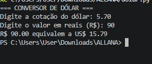

# dolar.py
Conversor de Dólar

O conversor de dólar é um programa simples desenvolvido em Python que realiza a conversão de valores em reais (R$) para dólares (US$). O usuário informa a cotação atual do dólar e o valor em reais que deseja converter. Em seguida, o programa realiza o cálculo dividindo o valor em reais pela cotação informada e exibe o resultado em dólares.

